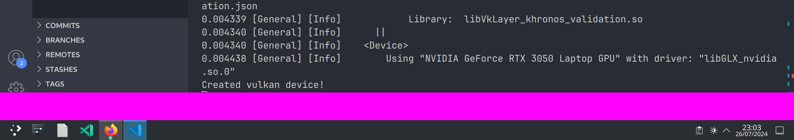

## Simple Vulkan-Backed Wayland Layer Shell
A small, simple Wayland client that uses the [wlr-layer-shell-unstable-v1](https://wayland.app/protocols/wlr-layer-shell-unstable-v1) extension protocol.

This is more of a proof-of-concept for making shell elements with Vulkan and `wlr-layer-shell`, so here's the pretty ugly magenta bar:

* Heavily based on the work of [Amini Allight](https://gitlab.com/amini-allight/wayland-vulkan-example), thank you!
* Implements most of the boilerplate necessary to get off the ground and use the [VK_KHR_wayland_surface](https://registry.khronos.org/vulkan/specs/1.3-extensions/man/html/VK_KHR_wayland_surface.html) Vulkan extension.
* Minimal dependencies (3 direct, <70 transitive).
* Did I mention it's written in Rust?!

Thanks to [`ash-rs`](https://github.com/ash-rs), and the people at [`Smithay`](https://github.com/Smithay/) for making Rust bindings to Vulkan and Wayland, respectively.

